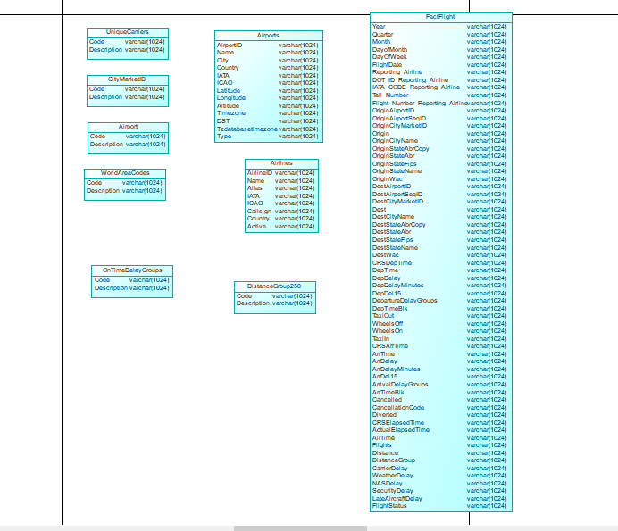
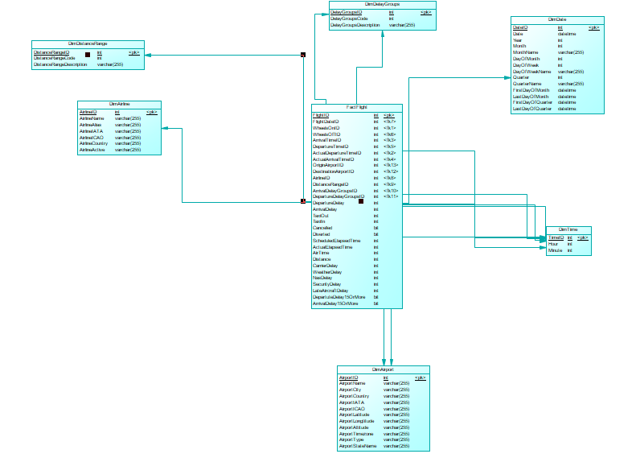

<h1>Projekt uniwersytecki wykonany na przedmiot Hurtownie danych</h1>
<h2>Użyte narzędzia</h2>
  <ul>
    <li>SAP Power Designer - w celu modelowania obszaru stage oraz obszaru repozytrium głównego</li>
    <li>MS SQL Server 2017</li>
    <li>Visual Studio 2017 z dodatkiem SQL Server Integration Services (SSIS) - w celu adminstrowania procesem ETL oraz wykonywania               procedur składowych</li>
    <li>Visual Studio 2017 z dodatkiem SQL Server Analysis Services (SSAS)</li>
    <li>Miscrosoft Power BI - w celach analizy biznesowej</li>
  </ul>
<h2>Krótki opis</h2>
  
Projekt polegał na zaprojektowaniu hurtownii danych dla lotów w USA w roku 2019. Źródło danych faktów: 
  <ul>
    <li><a href="https://transtats.bts.gov/DL_SelectFields.asp?Table_ID=236">Źródło danych dla tabeli faktów(Fact Flight)</a></li>
    <li><a href="https://openflights.org/data.html">Źródło danych dla tabel wymiarów</a></li>
  </ul>
  Projekt składał się z kilku etapów. Poszczególne etapy polegały na:
    <ol>
      <li>Przeprowadzeniu procesu ładowania danych z plików .csv do obszaru stage</li>
      <li>Przeprowadzeniu proces ETL. Proces ten został wykonany za pomocą procedur składowych, które czyściły, a następnie ładowały dane           do tabel wymiarów repozytrium głównego</li>
      <li>Kolejnym krokiem było załadowanie danych do tabeli faktów, gdzie za fakt przyjęto pojedyńczy lot. W tabeli faktów dane dotyczące            wymiarów zastąpiono danymi z tabel lookup</li> 
      <li>Dla obszaru repozytorium głównego należało utworzyć kostkę OLAP za pomocą narzędzia Visual Studio z dodatkiem SQL Server                    Analysis Services (SSAS)</li>
      <li>Ostatnim krokiem było wykonanie raportów w narzędziu Microsoft Power BI z użyciem wykonanej kostki OLAP</li>
    </ol>

  

<h2>Modele obszaru stage oraz obszaru reporyzorium głównego</h2>
<h3>Model stage</h3>

<h3>Model main repo</h3>

<h2>Dodatkowe informacje</h2>
  
W folderze Skrypty znajdują się skrypty zawierające procedury potrzebne do działania procesu ETL

  
W folderze Modele znajdują się Modele zamodelowane w Pwer Design-erze wraz z wygenerowanymi skryptami tworzącymi poszczegolne bazy     hurtowni danych

